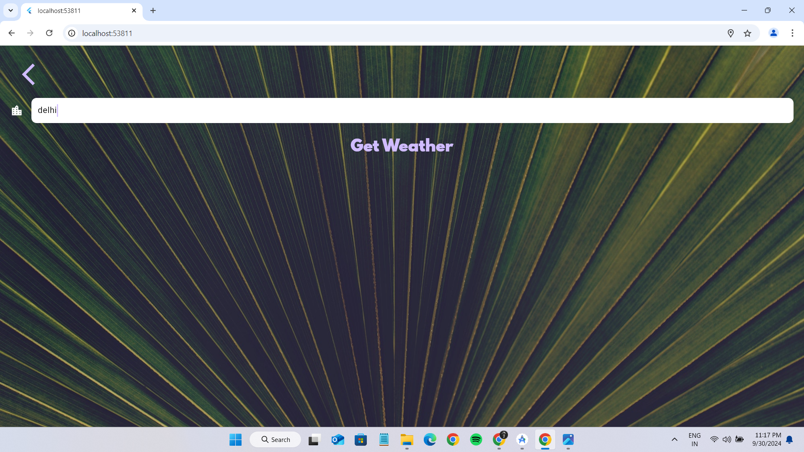

# clima

# 🌤️ Flutter Weather App

Welcome to the Flutter Weather App! This application provides real-time weather updates and forecasts for your current location, as well as any city around the world. Built with a sleek, modern design, it offers an intuitive user experience and powerful functionality, making it your go-to weather companion.

### 🚀 Features

• Live Weather Data: Get up-to-date weather information including temperature, humidity, wind speed, and more.

• Location-Based Search: Automatically fetch weather details for your current location using GPS.

• Global City Search: Enter any city name to find weather information from around the globe.

• Responsive UI: Enjoy a seamless experience on both mobile and web platforms.

• Asynchronous Programming: Efficient data handling with Dart's async/await for smooth and fast performance.

### 🛠️ Technologies Used

• Flutter: For building the cross-platform user interface.

• Dart: The primary language for Flutter development.

• APIs: Integrated with open weather APIs for real-time weather data.

• Asynchronous Programming: Using Dart’s async/await features to manage data flow and ensure a responsive app experience.

# 🔧 Installation
To run the app locally, follow these steps:

### Clone the repository:

    git clone https://github.com/Kekhe/flutter-weather-app.git
    
### Navigate to the project directory:

    cd flutter-weather-app
    
### Install dependencies:

    flutter pub get
    
### Run the app:

    flutter run

# Screenshots

